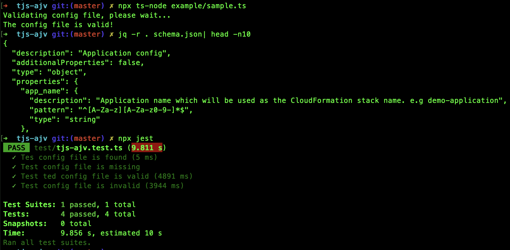

# TJS-AJV

## Overview

TJS-AJV is a handy tool that uses [TJS](https://github.com/YousefED/typescript-json-schema) to generate json schema from typescript interface, and uses [AJV](https://github.com/ajv-validator/ajv) to validate a config file against the json schema.

## Usage

- Define your Interface file which will be used to dynamically generate the json schema. For example, the [sample-schema.json](./example/sample-schema.json) schema file is generated from the typescript Interface [sample-interface.ts](./example/sample-interface.ts) by tjs-ajv.

- Define your config file, from example [sample-config.yml](./example/sample-config.yml). This file will be validated against the above json schema by tjs-ajv.

- Install [tjs-ajv](https://www.npmjs.com/package/tjs-ajv) `npm install tjs-ajv`.

Sample code:

```javascript
import * as path from "path";
import { loadConfig, validateConfig } from "tjs-ajv";

const INTERFACE_FILE = path.join(__dirname, "./sample-interface.ts");
const CONFIG_FILE = path.join(__dirname, "./sample-config.yml");

console.log("Validating config file, please wait...");
const loadResult = loadConfig(CONFIG_FILE);

if (!loadResult.success) {
  console.error(loadResult.message);
  process.exit(1);
} else {
  const validateResult = validateConfig(
    INTERFACE_FILE,
    "Config",
    loadResult.data
  );
  if (!validateResult.success) {
    console.error(validateResult.message);
    console.error(validateResult.data);
    process.exit(1);
  } else {
    console.log("The config file is valid!");
  }
}
```

## Development

- Clone repo: `git clone https://github.com/jc1518/tjs-ajv.git`

- Install dependencies: `cd tjs-ajv; npm install`

- Run sample code: `npx ts-node example/sample.ts`

- Check generated sample json schema file `jq -r . schema.json`

- Run test: `npx jest`


